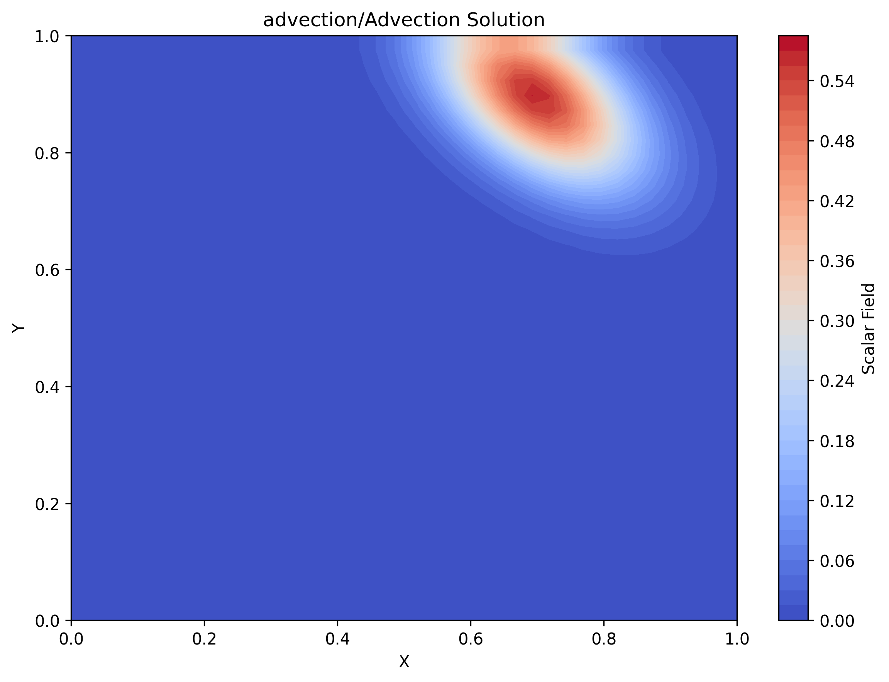
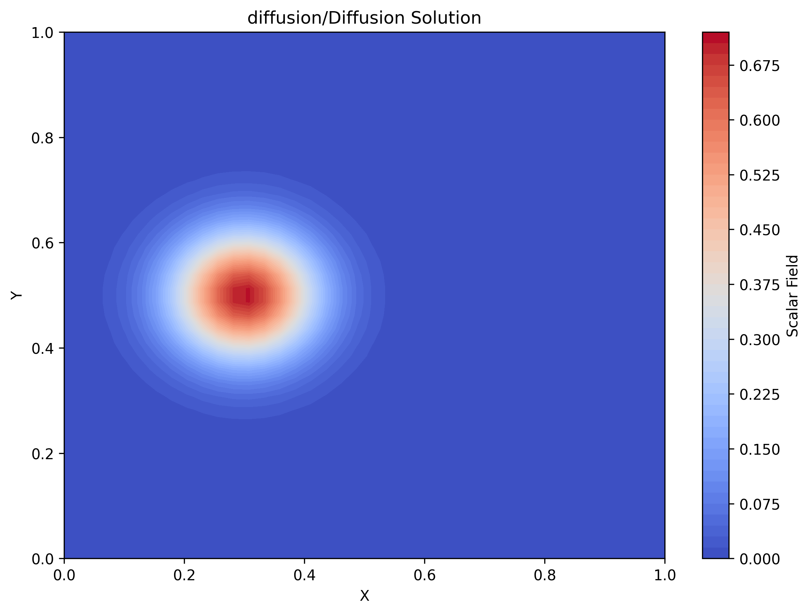
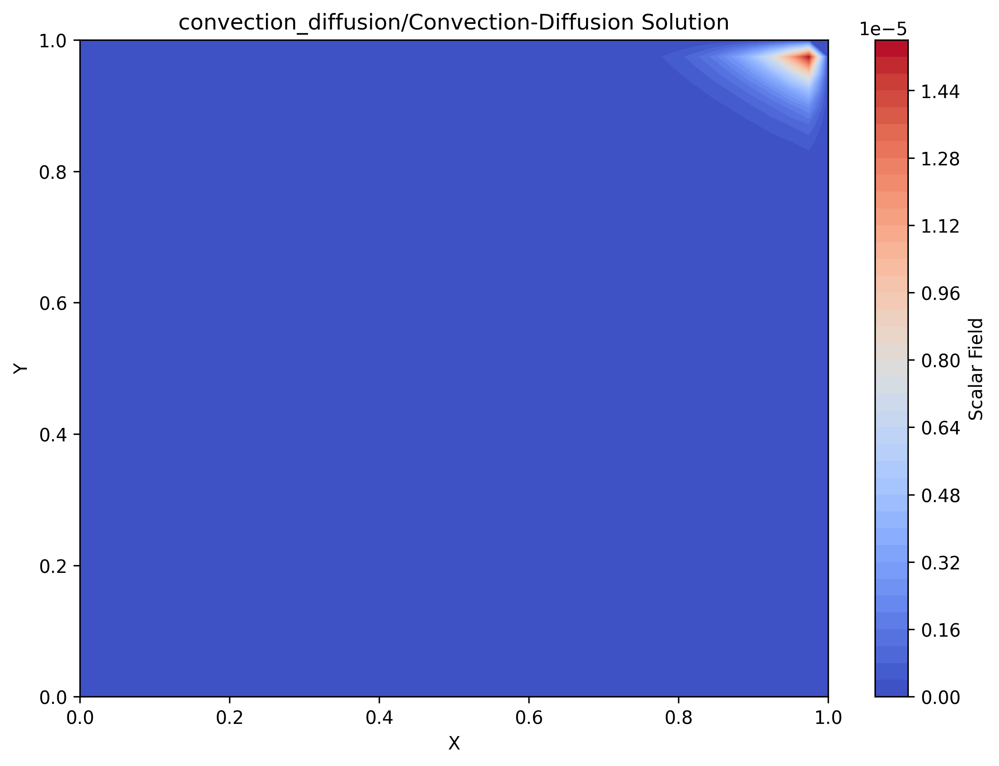
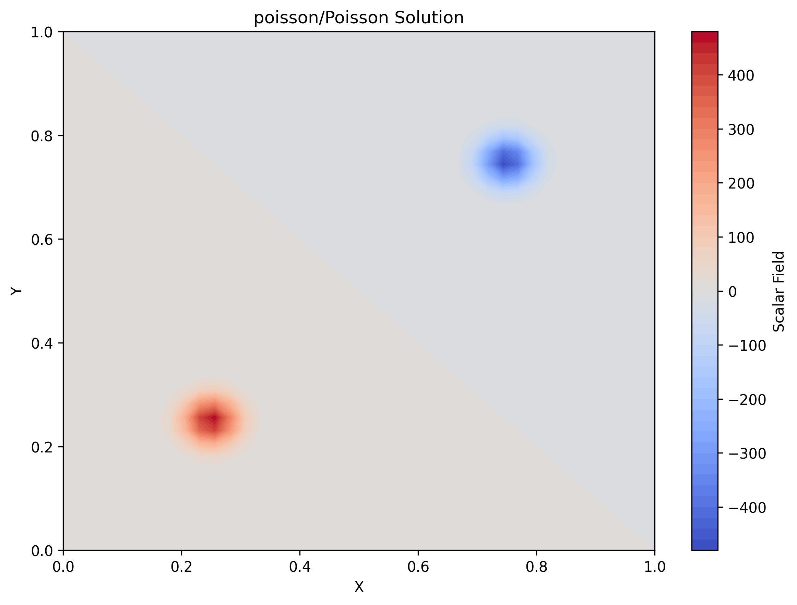
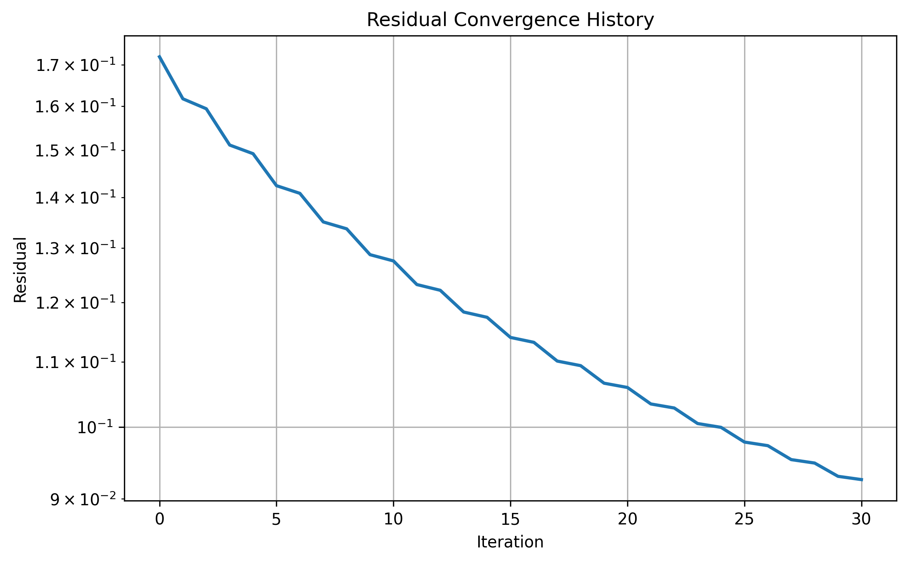
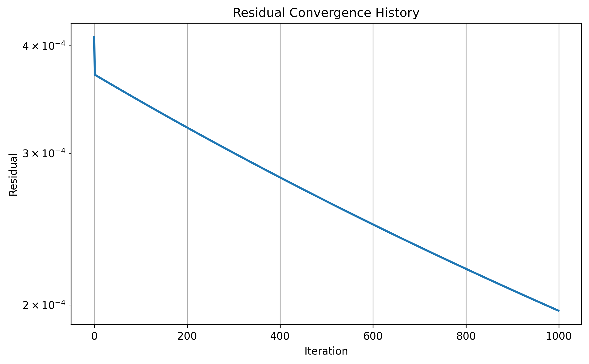
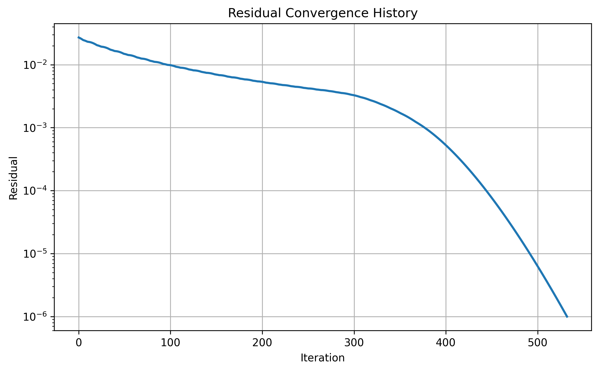
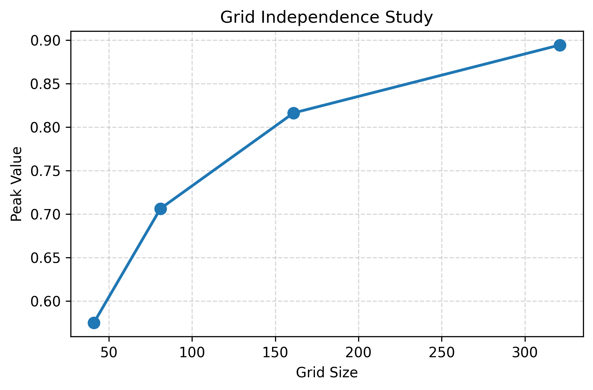

# 🚀 SpaceFlow CFD Solver

A modular 2D Computational Fluid Dynamics (CFD) solver developed in Python using the Finite Difference Method (FDM). SpaceFlow implements classical numerical methods for solving advection, diffusion, convection–diffusion, and Poisson equations with configurable boundary conditions, stability monitoring, convergence analysis, and scientific visualization.

---

## 🎯 Project Highlights

- Modular Python Architecture
- Four Numerical Solvers
- Configurable Boundary Conditions
- Real-time Visualization
- CFL Stability Monitoring
- Residual Convergence Analysis
- Grid Independence Validation

---

## 🛠 Technologies Used

| Category | Technology |
|----------|------------|
| Programming Language | Python 3 |
| Scientific Computing | NumPy |
| Visualization | Matplotlib |
| Numerical Method | Finite Difference Method (FDM) |
| Version Control | Git, GitHub |
| IDE | Visual Studio Code |

---

## ✨ Features

- 2D Advection Solver
- 2D Diffusion Solver
- Convection-Diffusion Solver
- Poisson Equation Solver
- Configurable Boundary Conditions
- CFL Stability Monitoring
- Residual Convergence Analysis
- Grid Independence Study
- Modular Project Architecture
- Real-time Visualization

---

## 📂 Project Structure

```text
SpaceFlow/
│
├── boundary/
├── initial_conditions/
├── mesh/
├── results/
│   ├── advection/
│   │   ├── advection.png
│   │   └── residual.png
│   │
│   ├── diffusion/
│   │   ├── diffusion.png
│   │   └── residual.png
│   │
│   ├── convection_diffusion/
│   │   ├── convection_diffusion.png
│   │   └── residual.png
│   │
│   ├── poisson/
│   │   |── poisson.png
|   |   └── residual.png
│   │
│   └── validation/
│       └── grid_independence.png
│
├── simulations/
├── solvers/
├── utils/
├── visualization/
│
├── config.py
├── main.py
├── requirements.txt
├── LICENSE
├── .gitignore
└── README.md
```
---

## 🧮 Numerical Methods

Implemented using the Finite Difference Method (FDM)

Current Solvers:

- 2D Linear Advection
- 2D Diffusion
- Convection–Diffusion
- Poisson Equation

Spatial Schemes:

- First Order Upwind
- Central Difference

Validation:

- CFL Condition
- Residual Monitoring
- Grid Independence Study

---

## ⚙️ Installation

1. Clone the repository

```bash
git clone <your_repository_link>
```

2. Navigate to the project directory

```bash
cd SpaceFlow
```

3. Install the required dependencies

```bash
pip install -r requirements.txt
```

4. Run the project

```bash
python main.py
```

---

## ▶️ How to Run

Open `main.py` and choose the simulation you want to run.

```python
SIMULATION = "advection"
```

Available options:

- "advection"
- "diffusion"
- "convection_diffusion"
- "poisson"
- "grid"

Then run:

```bash
python main.py
```

---

## 📊 Results

### 1. Advection Solver

Simulation of Gaussian pulse transport using the first-order upwind scheme.

<p align="center">
  
</p>

---

### 2. Diffusion Solver

Simulation of Gaussian pulse diffusion over time.

<p align="center">
  
</p>

---

### 3. Convection–Diffusion Solver

Combined transport and diffusion simulation.

<p align="center">
  
</p>

---

### 4. Poisson Equation

Numerical solution of the 2D Poisson equation using the Finite Difference Method.

<p align="center">
  
</p>

---

### 5. Residual Convergence

Residual history showing convergence of the numerical solution.

#### Advection

<p align="center">
  
</p>

#### Diffusion

<p align="center">
  
</p>

#### Convection–Diffusion

<p align="center">
  
</p>

---

### 6. Grid Independence Study

Validation of numerical accuracy through mesh refinement.

<p align="center">
  
</p>
---

## 🚀 Future Scope

- Higher Order Numerical Schemes
- Navier-Stokes Solver
- Adaptive Mesh Refinement
- Turbulence Models
- GPU Acceleration
- 3D CFD Solver
- SpaceFlow Lab Integration
- Compressible Flow Solver

---

## 👩‍💻 Author

Developed by **Reena Meena**

Mechanical Engineering Student interested in building engineering projects and learning technologies related to aerospace and simulation.

Current Interests:

- Aerospace Engineering
- Space Technology
- Engineering Simulations
- Problem Solving

---
